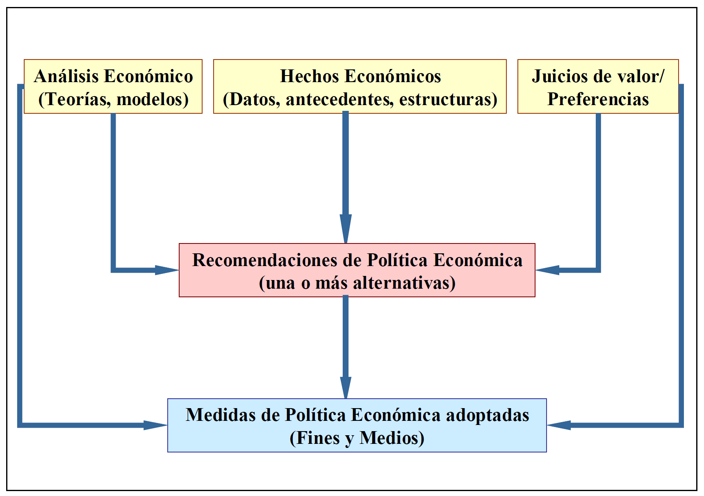

# Tema 1

## Clasificación de las ciencias

- Las **ciencias sociales** se centran en los **seres humanos** como seres sociales.
- Las **ciencias empíricas** utilizan **proposiciones sintéticas contrastables** (si no se verifican se quedan como *hipótesis*; si se verifica se convierte en ley). Dichas proprosiciones no deben ser tautológicas (deben tener un conocimiento añadido). También usan **proposiciones de tipo formal** (como las matemáticas), que establecen unas reglas de comportamiento.

!!! note "Tautológico"
    Que tiene un valor añadido. Si digo "mañana llueve o no llueve", no proporciona un valor añadido.

La economía es a la vez una ciencia empírica y una ciencia social:

- Ciencia empírica: construye sus teorías y modelos a partir de la observación de la realidad.
- Ciencia social: el objetivo es el estudio de las **relaciones** económicas del ser humano, no algo *físico*.

## Definiciones de la economía

- **Adam Smith:** ciencia de la riqueza o que enseña a adquirir riqueza
- **John Stuart Mill:** ciencia que estudia las leyes que regulan la producción, la distribución y el consumo de la riqueza
- **Karl Marx:** ciencia que estudia las relaciones entre los individuos en los procesos de producción y distribución de bienes
- **Corriente marginalista:** ciencia de los precios (del valor)
- **Ciencia lúgubre, Carlyle:** ciencia de la escasez
- **Robbins:** ciencia de la elección
- ^^**Jacov Viner:** Economía es todo lo que hacen los economistas^^

!!! quote "Keynes, 1924"
    *"Los economistas buenos escasean como los pájaros exóticos. Esta paradoja se explica porque el economista necesita poseer una combinación de dotes poco frecuente"*

    *"Debe estudiar el presente en función del pasado y pensando en el futuro"*

!!! quote "von Hayek"
    *"Ningún economista puede ser sólo economista"*

## La distinción positivo-normativa

La realidad se puede analizar desde dos perspectivas distintas:

- 1️⃣ **Analizar una dimensión espacial y/o temporal** (aspecto empírico o **positivo**): medir algo real, si mido una mesa y me da 2 metros nadie puede estar en contra → {++campo del SER++}
- 2️⃣ **Fundamento de las decisiones**, de las reglas de acción (aspecto normativo): poner pegas a la mesa - debería ser más grande, más pequeña, etc. No necesariamente unas posiciones son mejores que otras, no se pueden comparar → {++campo del DEBER-SER++}

|Positivo|Normativo|
|:--:|:--:|
|Descripción|Prescripción|
|Explicación|Recomendación|
|Teoría|Práctica|
|Pensamiento|Acción
|Leyes (uniformidades)|Reglas (normas)
|Ciencia|Arte
|Juicios sobre los hechos {: .red}|Jucios de valor {: .red}
|Declaraciones en modo indicativo|Declaraciones en modo imperativo
|Proposiciones que se pueden probar acerca de los hechos|Expresiones no comprobables de sentimientos
|Empirismo|Normativismo

### Distinción entre lo positivo y lo normativo

|Economía positiva|Economía normativa|
|:--:|:--:|
|Estudia los fenómenos económico, las fuerzas que los causan y busca predecir sus consecuencias ***ceteris paribus***|Busca los criterios que guían las decisiones económicas y opina sobre los objetivos a lograr por la actividad económica ***Juicios de valor, los criterios son subjetivos. Opiniones.***
|¿Qué ocurre con la cantidad que se demanda de un bien ante una subida de su precio en el mercado? ¿Cómo afecta una bajada de los tipos de interés a las inversiones que hacen las empresas? {: .red}|¿Deben los gobiernos mantener unos bajos niveles de impuestos? ¿Hay que gravar el ahorro o la movilidad de capitales? ¿Es necesario subvencionar la cultura? {: .red}|

==Características de la ciencia económica:==

1. Ciencia joven, moderna (Desde 1776) : *La economía es la más antigua de las artes y la más moderna de las ciencias*
2. Ciencia "blanda": *no hay verdades económicas universales. Irrealismo de los supuestos (condición `ceteris paribus`)*
3. Ciencia empírica: se ocupa de la realidad
4. Ciencia social: se ocupa de las relaciones entre las personas
5. Ciencia con doble vertiente: positivo-normativa (ciencia empírica positiva, pero no existe ciencia social desinteresada)
6. Distintos enfoques: **microeconomía** y **macroeconomía**

??? info "Extra: la política económica como disciplina autónoma dentro de la ciencia económica"
    **Características de la política económica como conocimiento autónomo:**

    - **Antecedentes:** cameralismo y escuela histórica alemana (ciencia de la adminsitración pública). *Los burócratas alemanes que trabajaban para la administración pública*
    - **Tradición continental europea:** en países anglosajones. Los anglosajones parten la política en sus distintas partes (económica, industrial, agraria, transportes, exterior).
    - **Relación intensa con otras ramas de la economía:** relacionada con la Hacienda Pública (gestiona los ingresos y gastos públicos, reflejado en los presupuestos generales), con la esctructura económica y con la econometría.
    - **Impulso con la aportación keynesiana:** Keynes dice que el mercado no resuelve los problemas de la socidad, necesita el sector público. Introduce el concepto **intervecionismo** - ante fallos del mercado el sector público interviene.
    - **Tributaria del análisis económico teórico:** no estudiaremos el modelo en sí, sino para qué sirve ese modelo económico.
    - **Interacción con las otras ciencias sociales (política):** poder económico $↔$ poder político. El poder económico no conlleva poder político.

## El concepto de la política económica

**La política económica como praxis:** actuaciones y medidas adoptadas por las autoridades públicas, fruto de una acción deliberada que pretende afectar a un conjunto de fines u objetivos de carácter socioeconómicos.

1. Debe ser una **autoridad pública** (^^NO HAY POLÍTICA ECONÓMICA PRIVADA^^)
2. Debe ser una acción deliberada (puede ser no hacer nada deliberadamente, dejar pasar)
3. Los objetivos deben ser deseables (un objetivo no puede ser *"incrementar el paro"* porque el paro no es deseable)

### La Política Económica como teoría

La **Política Económica** (teoría) es el estudio y análisis científico del **proceso de toma de decisiones** por los gobiernos y otras instituciones con el objetivo de conseguir un efecto económico deseable. {>>hay que definir criterios, fines y medios de la actividad politico-económica del Estado<<}

!!! note "Teoría y práctica"
    Nos referimos a la parte teórica como **Política Económica**, y a la parte práctica como **política económica**.

**Contenido de la Política Económica:** estudio del concepto (tema 1), método (tema 1), objetivos (tema 2), instrumentos (tema 3) y proceso de elaboración (temas 4 y 5) de la Política Económica.

#### Evolución del concepto de política económica

!!! info
    La política económica (como práctica) es anterior a la economía como ciencia. Se hacía con anterioridad a Adam Smith.

Definiciones:

- **Arte económico**: hasta finales del siglo `XIX`.
- **Estudio acción del estado en lo económico**: siglo `XX`.
- **Rama de la ciencia política**
- **Ciencia normativa**
- **Técnica económica**
- **Economía aplicada** (lo más cercano a lo actual)

!!! quote "Concepción actual"
    Una disciplina mixta "positivo-normativa" de la Economía, interrelacionada con el Análisis Económico Teórico (parte positiva) y ocn la Ciencia Política, que se mueve en la vertiente de las recomendaciones económicas (parte normativa) y estudia el tratamiento científico de las acciones llevadas a cabo por el Estado y por otros agentes institucionales para dirigir la economía hacia el logro de unos determinados fines.

#### Decisiones

Tenemos unos hechos económicos que pueden venir dados por estadísticas, antecedentes, etc. *Ej: descenso del nivel de consumo, aumento del nivel de paro, descenso del nivel de inflacción, reducción del PIB, etc.* Son objetivos.

Tenemos unaas referencias o juicios de valor, ideologías económicas. *Ej: intervencionismo, liberalismo, proteccionismo, etc.*

Tenemos un modelo que parte de una serie de sucesos. *Ej: modelo de demanda agregada keynesiana, `DA = Consumo + Inversión + Gasto público + eXportaciones - iMportaciones`*.

Teniendo en cuenta estos tres factores podemos emitir recomendaciones de Política Económica (una o más alternativas). *Ej: bajar los tipos de interés, reducción de impuestos, devaluación monetaria, reformas estructurales, etc.*

Al final tenemos una serie de medidas de Política Económica adoptadas en las cuales se tienen que explicar las relaciones entre los fines y los medios.

### La política económica en el pensamiento económico

#### Mercantilismo

La riqueza en dinero (oro, plata) es el valor supremo y el comercio es la forma de obtener esa riqueza. **Objetivo: mantener una balanza comercial más favorable (exportaciones > importaciones)**

- Continúa la intervención del Estado
- Proteccionismo comercial (**reducción de importaciones**)
- **Potenciación** de la industria y **de las exportaciones**

#### Escuela clásica

La riqueza se deriva de los bienes y servicios producidos que se encuentren disponibles en el mercado y no de la cantidad de dinero.

- ^^Minimización de las intervenciones públicas en el ámbito económico^^ (división de Bentham), reservando al Estado tres funciones exclusivamente:
    - Asegurar la defensa nacional
    - Administración de justicia
    - Realización de obras de indudable interés público
- **Contraria al control público de precios, monopolios, proteccionismo, reglamentación pública, etc.**

#### Marxismo

Ideología que aspira al derrumbamiento final del sistema capitalista

- La Política Económica es un **instrumento al servicio del sistema capitalista para procurar supervivencia** y de la propiedad privada de los medios de producción.

#### Escuela neoclásica

^^Formalización económica y desarrollo del análisis marginal (microeconómico).^^

- Interés por el estudio del equilibrio y del papel de las fuerzas del mercado.
- **Escaso interés por el papel de las políticas públicas**.

#### Keynesianismo

Justificación teórica de la necesidad de la intervención del sector público en la economía y relevancia del enfoque macroeconómico.

- Aporte de instrumental analítico y desarrollo del cuerpo teórico de la Economía (Teoría General)
- Política Económica basada en recomendaciones a favor de la intervención pública (políticas activas). *Como un médico, ¿qué hago si tengo paro? Miro el manual.*
- Supuestos de Harvey Road: confianza en decisiones de política económica, cultos y juiciosos, que buscan siempre el bien común y el progreso económico.

## El método en política económica

**Método:** conjunto de operaciones ordenadas con las que se pretende obtener un resultado.

Consideraciones:

1. Dificultades por la falta de consenso y por la existencia de múltiples controversias.
2. Se encuadra en el campo de la Teoría de la Política Económica.
3. Existen dos enfoques princpales:
      - Enfoque convencional → esquema fines-medios (piensan que todo es maravilloso, como la competencia perfecta). Muy cuestionado al no considerar la interrelación existente entre `política` y `política económica` y por otros fenómenos
      - Enfoque crítico: nueva teoría de Política Económica.
